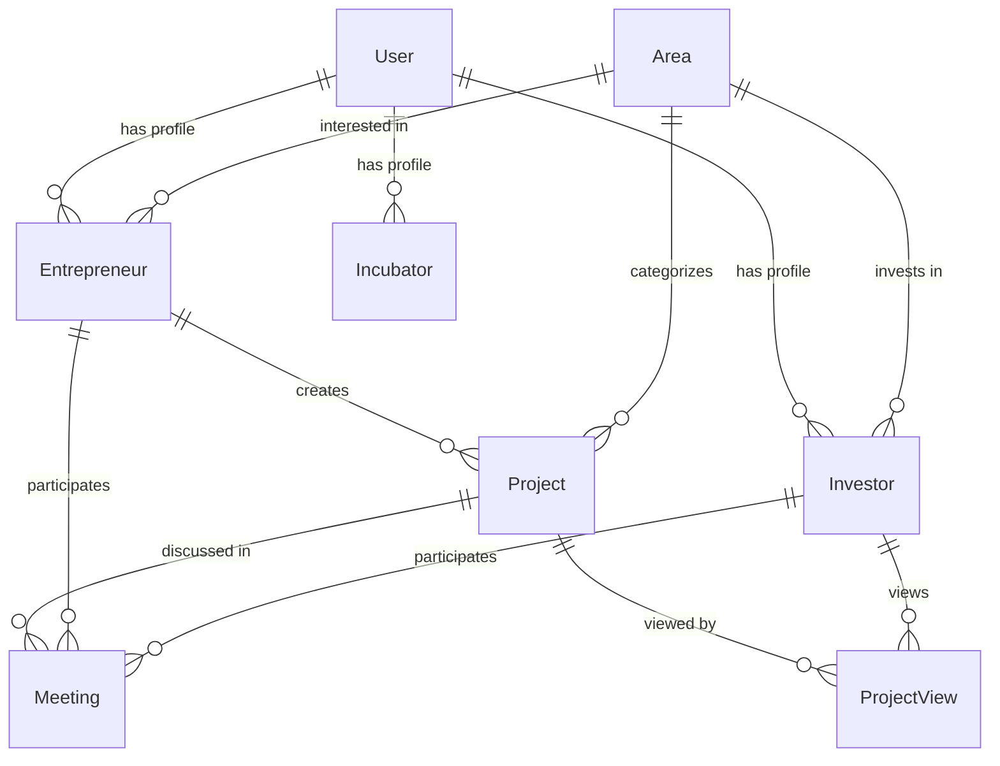

# 📖 Guia do Desenvolvedor - Im-Vestor Platform

Este guia complementa o onboarding com informações técnicas detalhadas sobre a arquitetura e padrões do projeto.

## 🗄️ Estrutura do Banco de Dados

### Principais Entidades

#### User (Clerk Integration)
```typescript
// Gerenciado pelo Clerk, não diretamente no Prisma
interface User {
  id: string; // Clerk User ID
  email: string;
  userType: 'ENTREPRENEUR' | 'INVESTOR' | 'INCUBATOR' | 'PARTNER' | 'ADMIN';
  userIsAdmin: boolean;
}
```

#### Entrepreneur
```typescript
interface Entrepreneur {
  id: string;
  userId: string; // Clerk User ID
  name: string;
  email: string;
  phone: string;
  countryId: number;
  stateId: number;
  areas: Area[]; // Áreas de interesse
  projects: Project[];
  meetings: Meeting[];
}
```

#### Investor
```typescript
interface Investor {
  id: string;
  userId: string; // Clerk User ID
  name: string;
  email: string;
  phone: string;
  countryId: number;
  stateId: number;
  areas: Area[]; // Áreas de investimento
  investmentRange: string;
  projectViews: ProjectView[];
  meetings: Meeting[];
}
```

#### Project
```typescript
interface Project {
  id: string;
  name: string;
  description: string;
  stage: ProjectStage;
  entrepreneurId: string;
  countryId: number;
  stateId: number;
  areaId: string;
  fundingGoal: number;
  currentFunding: number;
  views: ProjectView[];
  meetings: Meeting[];
}
```

### Relacionamentos Principais



## 🔌 API Structure (tRPC)

### Router Organization

```typescript
// src/server/api/root.ts
export const appRouter = createTRPCRouter({
  auth: authRouter,
  projects: projectsRouter,
  users: usersRouter,
  meetings: meetingsRouter,
  admin: adminRouter,
  notifications: notificationsRouter,
  payments: paymentsRouter,
});
```

### Exemplo de Router

```typescript
// src/server/api/projects.ts
export const projectsRouter = createTRPCRouter({
  // Query - Buscar dados
  getAll: publicProcedure
    .input(z.object({
      limit: z.number().min(1).max(100).default(10),
      cursor: z.string().nullish(),
    }))
    .query(async ({ ctx, input }) => {
      const projects = await ctx.db.project.findMany({
        take: input.limit + 1,
        cursor: input.cursor ? { id: input.cursor } : undefined,
        include: {
          entrepreneur: true,
          area: true,
          country: true,
          state: true,
        },
      });

      return {
        projects: projects.slice(0, input.limit),
        nextCursor: projects.length > input.limit ? projects[input.limit]?.id : null,
      };
    }),

  // Mutation - Modificar dados
  create: protectedProcedure
    .input(createProjectSchema)
    .mutation(async ({ ctx, input }) => {
      return ctx.db.project.create({
        data: {
          ...input,
          entrepreneurId: ctx.auth.userId!,
        },
        include: {
          entrepreneur: true,
          area: true,
        },
      });
    }),
});
```

### Schemas de Validação

```typescript
// src/server/api/schemas/project.ts
export const createProjectSchema = z.object({
  name: z.string().min(1).max(100),
  description: z.string().min(10).max(1000),
  stage: z.enum(['IDEA', 'MVP', 'GROWTH', 'SCALE']),
  countryId: z.number(),
  stateId: z.number(),
  areaId: z.string(),
  fundingGoal: z.number().positive(),
});

export const updateProjectSchema = createProjectSchema.partial();
```

## 🎨 Component Architecture

### Estrutura de Componentes

```
components/
├── ui/                    # Componentes base (shadcn/ui)
│   ├── button.tsx
│   ├── card.tsx
│   ├── dialog.tsx
│   └── ...
├── forms/                 # Formulários específicos
│   ├── project-form.tsx
│   ├── user-form.tsx
│   └── ...
├── layout/                # Componentes de layout
│   ├── header.tsx
│   ├── sidebar.tsx
│   └── footer.tsx
├── features/              # Componentes por feature
│   ├── projects/
│   ├── meetings/
│   └── admin/
└── common/                # Componentes compartilhados
    ├── loading.tsx
    ├── error-boundary.tsx
    └── ...
```

### Padrão de Componente

```typescript
// components/features/projects/project-card.tsx
import { Card, CardContent, CardHeader, CardTitle } from "@/components/ui/card";
import { Button } from "@/components/ui/button";
import { Badge } from "@/components/ui/badge";
import { api } from "@/utils/api";

interface ProjectCardProps {
  project: {
    id: string;
    name: string;
    description: string;
    stage: string;
    fundingGoal: number;
    currentFunding: number;
  };
  onView?: (id: string) => void;
}

export function ProjectCard({ project, onView }: ProjectCardProps) {
  const fundingPercentage = (project.currentFunding / project.fundingGoal) * 100;

  return (
    <Card className="w-full hover:shadow-lg transition-shadow">
      <CardHeader>
        <div className="flex justify-between items-start">
          <CardTitle className="text-lg">{project.name}</CardTitle>
          <Badge variant="secondary">{project.stage}</Badge>
        </div>
      </CardHeader>
      <CardContent>
        <p className="text-muted-foreground mb-4 line-clamp-3">
          {project.description}
        </p>

        <div className="space-y-2 mb-4">
          <div className="flex justify-between text-sm">
            <span>Progresso do financiamento</span>
            <span>{fundingPercentage.toFixed(1)}%</span>
          </div>
          <div className="w-full bg-secondary rounded-full h-2">
            <div
              className="bg-primary h-2 rounded-full transition-all"
              style={{ width: `${Math.min(fundingPercentage, 100)}%` }}
            />
          </div>
        </div>

        {onView && (
          <Button onClick={() => onView(project.id)} className="w-full">
            Ver Detalhes
          </Button>
        )}
      </CardContent>
    </Card>
  );
}
```

## 🔐 Authentication & Authorization

### Clerk Integration

```typescript
// middleware.ts
import { clerkMiddleware, createRouteMatcher } from "@clerk/nextjs/server";

const isProtectedRoute = createRouteMatcher([
  '/admin(.*)',
  '/home(.*)',
  '/profile(.*)',
]);

export default clerkMiddleware(async (auth, req) => {
  if (isProtectedRoute(req)) {
    const { userId, sessionClaims } = await auth();
    const isAdmin = sessionClaims?.publicMetadata?.userIsAdmin;

    if (!userId) {
      return Response.redirect(new URL("/login", req.url));
    }

    if (req.nextUrl.pathname.startsWith('/admin') && !isAdmin) {
      return Response.redirect(new URL("/404", req.url));
    }
  }
});
```

### User Context

```typescript
// contexts/user-context.tsx
import { useUser } from "@clerk/nextjs";
import { createContext, useContext } from "react";

interface UserContextType {
  user: User | null;
  userType: UserType | null;
  isAdmin: boolean;
  isLoading: boolean;
}

const UserContext = createContext<UserContextType | null>(null);

export function UserProvider({ children }: { children: React.ReactNode }) {
  const { user, isLoaded } = useUser();

  const userType = user?.publicMetadata?.userType as UserType | null;
  const isAdmin = user?.publicMetadata?.userIsAdmin as boolean || false;

  return (
    <UserContext.Provider value={{
      user,
      userType,
      isAdmin,
      isLoading: !isLoaded,
    }}>
      {children}
    </UserContext.Provider>
  );
}

export function useUserContext() {
  const context = useContext(UserContext);
  if (!context) {
    throw new Error("useUserContext must be used within UserProvider");
  }
  return context;
}
```

## 💳 Payment Integration (Stripe)

### Setup

```typescript
// lib/stripe.ts
import Stripe from 'stripe';

export const stripe = new Stripe(env.STRIPE_SECRET_KEY, {
  apiVersion: '2024-06-20',
});

// Webhook handler
export async function handleStripeWebhook(req: Request) {
  const body = await req.text();
  const signature = req.headers.get('stripe-signature')!;

  const event = stripe.webhooks.constructEvent(
    body,
    signature,
    env.STRIPE_WEBHOOK_SECRET
  );

  switch (event.type) {
    case 'checkout.session.completed':
      // Handle successful payment
      break;
    case 'payment_intent.payment_failed':
      // Handle failed payment
      break;
  }
}
```

### Payment Components

```typescript
// components/payments/checkout-button.tsx
import { loadStripe } from '@stripe/stripe-js';
import { api } from '@/utils/api';

export function CheckoutButton({ priceId, productName }: {
  priceId: string;
  productName: string;
}) {
  const createCheckoutSession = api.payments.createCheckoutSession.useMutation();

  const handleCheckout = async () => {
    const { url } = await createCheckoutSession.mutateAsync({
      priceId,
      productName,
    });

    if (url) {
      window.location.href = url;
    }
  };

  return (
    <Button
      onClick={handleCheckout}
      disabled={createCheckoutSession.isLoading}
    >
      {createCheckoutSession.isLoading ? 'Processando...' : 'Comprar'}
    </Button>
  );
}
```

## 📹 Video Integration (Daily.co)

### Meeting Setup

```typescript
// lib/daily.ts
import Daily from '@daily-co/daily-js';

export function createDailyRoom(meetingId: string) {
  return fetch('https://api.daily.co/v1/rooms', {
    method: 'POST',
    headers: {
      'Authorization': `Bearer ${env.DAILY_API_KEY}`,
      'Content-Type': 'application/json',
    },
    body: JSON.stringify({
      name: `meeting-${meetingId}`,
      properties: {
        max_participants: 10,
        enable_recording: true,
        enable_screenshare: true,
      },
    }),
  });
}

// components/meetings/video-call.tsx
import { DailyProvider } from '@daily-co/daily-react';

export function VideoCall({ roomUrl }: { roomUrl: string }) {
  return (
    <DailyProvider url={roomUrl}>
      <div className="w-full h-screen">
        <DailyVideo />
        <DailyControls />
      </div>
    </DailyProvider>
  );
}
```

## 🌐 Internationalization

### Setup

```typescript
// next.config.js
const config = {
  i18n: {
    locales: ['en-US', 'pt-PT', 'pt-BR'],
    defaultLocale: 'en-US',
  },
};

// contexts/language-context.tsx
import { createContext, useContext, useState } from 'react';

interface LanguageContextType {
  locale: string;
  setLocale: (locale: string) => void;
  t: (key: string) => string;
}

const LanguageContext = createContext<LanguageContextType | null>(null);

export function LanguageProvider({ children }: { children: React.ReactNode }) {
  const [locale, setLocale] = useState('en-US');

  const t = (key: string) => {
    // Implementar sistema de tradução
    return translations[locale]?.[key] || key;
  };

  return (
    <LanguageContext.Provider value={{ locale, setLocale, t }}>
      {children}
    </LanguageContext.Provider>
  );
}
```

## 📊 Analytics & Monitoring

### Google Analytics

```typescript
// lib/analytics.ts
import { GoogleAnalytics } from '@next/third-parties/google';

export function Analytics() {
  return <GoogleAnalytics gaId={env.NEXT_PUBLIC_GA_ID} />;
}

// Tracking events
export function trackEvent(eventName: string, parameters?: Record<string, any>) {
  if (typeof window !== 'undefined' && window.gtag) {
    window.gtag('event', eventName, parameters);
  }
}
```

### Error Monitoring

```typescript
// lib/error-monitoring.ts
export function logError(error: Error, context?: Record<string, any>) {
  console.error('Error:', error, context);

  // Enviar para serviço de monitoramento (Sentry, etc.)
  if (process.env.NODE_ENV === 'production') {
    // Sentry.captureException(error, { extra: context });
  }
}
```

## 🧪 Testing Patterns

### Component Testing

```typescript
// __tests__/components/project-card.test.tsx
import { render, screen } from '@testing-library/react';
import { ProjectCard } from '@/components/features/projects/project-card';

const mockProject = {
  id: '1',
  name: 'Test Project',
  description: 'Test description',
  stage: 'IDEA',
  fundingGoal: 100000,
  currentFunding: 25000,
};

describe('ProjectCard', () => {
  it('renders project information correctly', () => {
    render(<ProjectCard project={mockProject} />);

    expect(screen.getByText('Test Project')).toBeInTheDocument();
    expect(screen.getByText('Test description')).toBeInTheDocument();
    expect(screen.getByText('25.0%')).toBeInTheDocument();
  });

  it('calls onView when button is clicked', () => {
    const mockOnView = jest.fn();
    render(<ProjectCard project={mockProject} onView={mockOnView} />);

    screen.getByText('Ver Detalhes').click();
    expect(mockOnView).toHaveBeenCalledWith('1');
  });
});
```

### API Testing

```typescript
// __tests__/api/projects.test.ts
import { createMocks } from 'node-mocks-http';
import { handler } from '@/pages/api/projects';

describe('/api/projects', () => {
  it('returns projects list', async () => {
    const { req, res } = createMocks({
      method: 'GET',
    });

    await handler(req, res);

    expect(res._getStatusCode()).toBe(200);
    expect(JSON.parse(res._getData())).toHaveProperty('projects');
  });
});
```

## 🚀 Performance Optimization

### Image Optimization

```typescript
// next.config.js
const config = {
  images: {
    remotePatterns: [
      {
        hostname: '**',
        protocol: 'https',
      },
    ],
    formats: ['image/webp', 'image/avif'],
  },
};

// components/optimized-image.tsx
import Image from 'next/image';

export function OptimizedImage({ src, alt, ...props }: {
  src: string;
  alt: string;
  [key: string]: any;
}) {
  return (
    <Image
      src={src}
      alt={alt}
      placeholder="blur"
      blurDataURL="data:image/jpeg;base64,/9j/4AAQSkZJRgABAQAAAQABAAD/2wBDAAYEBQYFBAYGBQYHBwYIChAKCgkJChQODwwQFxQYGBcUFhYaHSUfGhsjHBYWICwgIyYnKSopGR8tMC0oMCUoKSj/2wBDAQcHBwoIChMKChMoGhYaKCgoKCgoKCgoKCgoKCgoKCgoKCgoKCgoKCgoKCgoKCgoKCgoKCgoKCgoKCgoKCgoKCj/wAARCAABAAEDASIAAhEBAxEB/8QAFQABAQAAAAAAAAAAAAAAAAAAAAv/xAAUEAEAAAAAAAAAAAAAAAAAAAAA/8QAFQEBAQAAAAAAAAAAAAAAAAAAAAX/xAAUEQEAAAAAAAAAAAAAAAAAAAAA/9oADAMBAAIRAxEAPwCdABmX/9k="
      {...props}
    />
  );
}
```

### Code Splitting

```typescript
// Lazy loading de componentes
import dynamic from 'next/dynamic';

const HeavyComponent = dynamic(() => import('./heavy-component'), {
  loading: () => <div>Carregando...</div>,
  ssr: false,
});

// Lazy loading de páginas
const AdminPage = dynamic(() => import('@/pages/admin'), {
  loading: () => <div>Carregando admin...</div>,
});
```

## 🔧 Development Tools

### VS Code Extensions

```json
{
  "recommendations": [
    "bradlc.vscode-tailwindcss",
    "ms-vscode.vscode-typescript-next",
    "prisma.prisma",
    "esbenp.prettier-vscode",
    "ms-vscode.vscode-eslint",
    "formulahendry.auto-rename-tag",
    "christian-kohler.path-intellisense"
  ]
}
```

### Debug Configuration

```json
// .vscode/launch.json
{
  "version": "0.2.0",
  "configurations": [
    {
      "name": "Next.js: debug server-side",
      "type": "node",
      "request": "launch",
      "program": "${workspaceFolder}/node_modules/.bin/next",
      "args": ["dev"],
      "console": "integratedTerminal",
      "skipFiles": ["<node_internals>/**"]
    },
    {
      "name": "Next.js: debug client-side",
      "type": "chrome",
      "request": "launch",
      "url": "http://localhost:3000"
    }
  ]
}
```